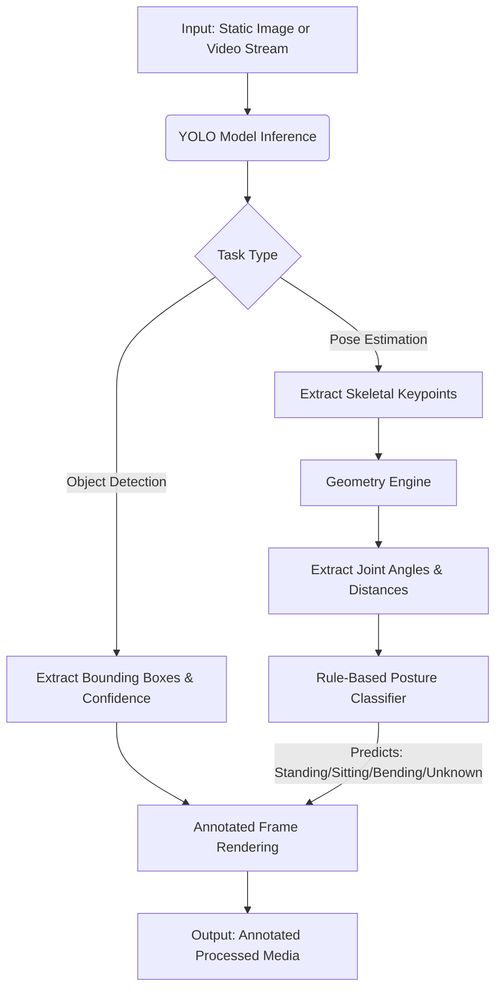

# Posture Exploration & Object Detection


## Overview & Impact
This project explores the capabilities of state-of-the-art computer vision models, specifically YOLO (You Only Look Once), for robust object detection and human posture estimation. 

Initially developed as an experimental Jupyter Notebook, the codebase has been significantly refactored into a modular Python project. This modular architecture separates configuration, mathematical calculations, heuristic logic, and model inference into discrete components, demonstrating a commitment to clean code principles, testability, and maintainability. By automating posture classification (Standing, Sitting, Bending), this exploration serves as a foundational step toward intelligent surveillance, ergonomic monitoring, or automated action recognition systems.

## System Architecture



## Exploratory Background & Engineering Decisions
The core of the project relies on **YOLO's Pose Estimation** to identify human keypoints (hips, knees, etc.). Instead of training a secondary classifier on these keypoints, I explored a **rule-based algorithmic approach** to classify postures. 

* **Geometric Heuristics**: The system calculates the angles between critical joints (e.g., hip angle, knee angle) and vertical distances. This approach allows for interpretable decision-making (e.g., if knee is bent < 120 degrees and vertical distance is minimal, the posture is "Sitting").
* **Modular Codebase**: Transitioning from a linear notebook script to a structured application (`src/config.py`, `src/geometry.py`, `src/posture_logic.py`, `src/detector.py`) improves reusability. The math can be unit-tested completely independently from the heavyweight ML inferencing script.

## Getting Started

### Prerequisites
* Python 3.8+
* Ensure you have valid image or video samples you wish to process.

### Installation
1. Clone the repository and navigate to the project directory.
2. Install the necessary dependencies:
```bash
pip install -r requirements.txt
```

### Usage
The entry point to the application is `main.py`.

1. Prepare your input files by placing them in an accessible directory (e.g., `data/images/` or `data/videos/`).
2. Update the target directories/files at the bottom of the `main.py` file.
3. Execute the script:
```bash
python main.py
```
Outputs (annotated images or videos) will be automatically generated and saved in your specified output directory (defaults to `output_images` and `output_video.mp4`).

## Future Improvements & Next Steps
* **Migrate to a Web Service**: Wrap the inference engine in a FastAPI application to allow for RESTful image/video uploads and processing.
* **Train a Machine Learning Classifier**: Replace the current hardcoded geometric rules with an SVM or lightweight neural network trained on normalized keypoints to handle edge cases and unusual camera angles more dynamically.
* **Real-time Processing**: Implement a multithreaded queue system and integrate OpenCV's `VideoCapture(0)` to feed live webcam streams into the detection node. 
* **Unit Testing**: Introduce `pytest` suites specifically for testing the mathematical bounds in the `geometry` and `posture_logic` modules.
